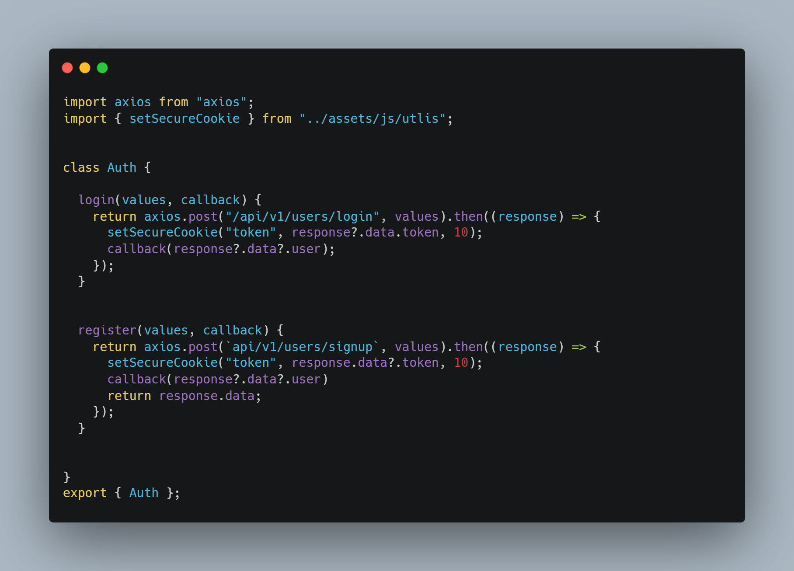
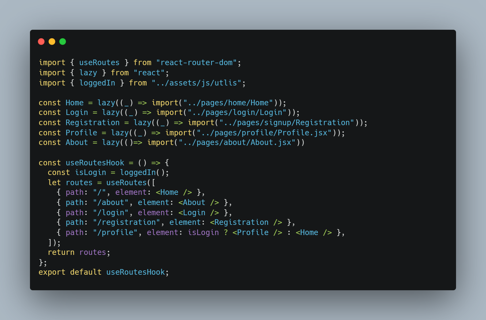

# React-Architecture

## Description
This is the best React architecture I have found, designed with a clean and modular structure to ensure scalability and maintainability

## Folder Structure 
 src/
├── apis/         # Contains functions for API calls and data fetching.
├── assets/       # Stores all utilities fucntions , fonts and  images .
├── context/      # React Contexts for managing global state.
├── layout/       # Layout components such as headers, footers, and wrappers.
├── pages/        # Contains React components that represent different pages.
├── routes/       # Manages routing logic and navigation within the app.

## apis Folder 
apis/         # Contains files for interacting with the backend APIs. Each file includes JS classes with methods that return promises and handle them within their respective components.
│   ├── Auth.js   # Contains methods related to user authentication, such as login, registration, etc. Methods like `login()` return promises and handle responses.
│   └── Product.js # Contains methods related to product data, such as fetching product details or updating product information.

then you can instaneitate an object in its own component 

##Routes Folder 
routes/         
│   ├── routes.jsx 
its custom hook using useRoutesHook with lazy loading and protected route and i mange all route in this file 

 

## Component Folder 
routes/         
│   ├── LoginForm.jsx 
│   └── data.jsx 

I have separated the UI and login functionality by encapsulating the  logic into a custom hook named useDataGetter, which resides in the data.jsx file. This approach promotes a cleaner, more modular architecture by isolating the logic from the presentation layer. In the UI component, I import the useDataGetter hook and destructure its returned values (such as user, error, and the login function) to manage the login state and handle user authentication.

## Axios Confige file 
├── assets/
│   ├── js/
│   │   └── axiosConfig.js  # Axios configuration file for API requests and interceptors. 

